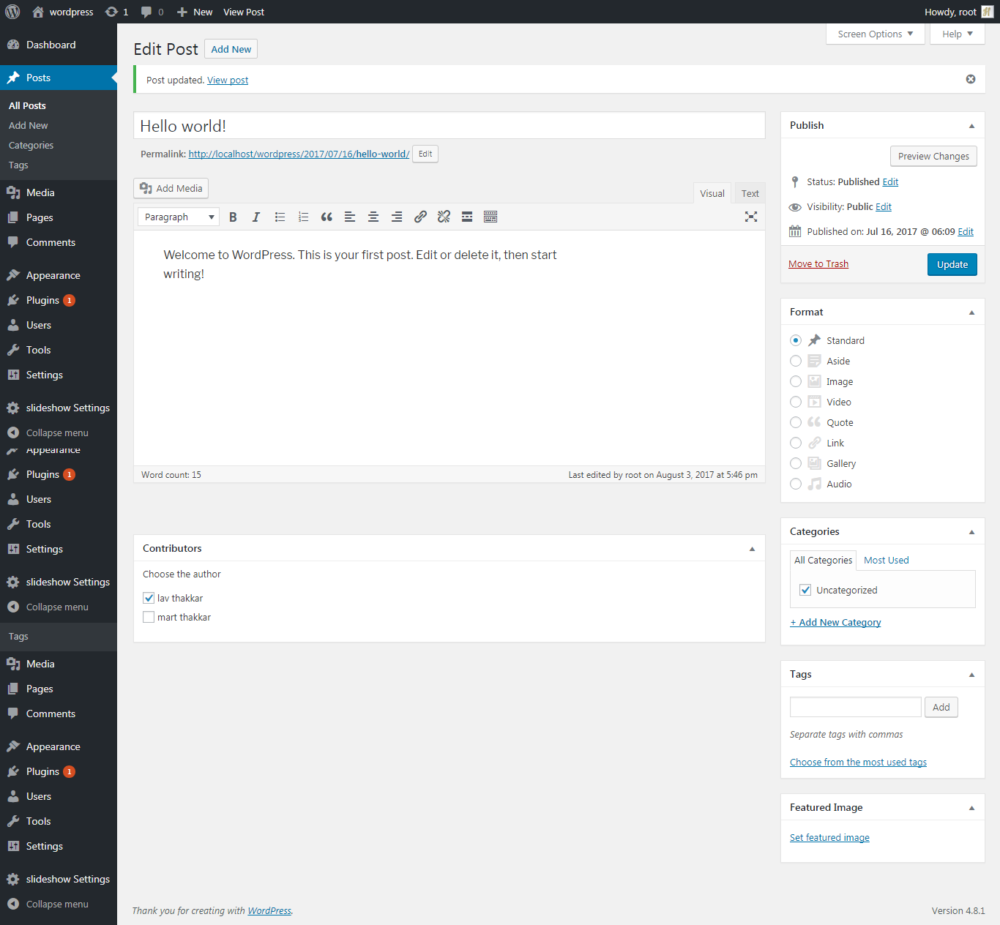

# rtcamp_contributors_assignment
Following plugin contain assignment given by RT-Camp for WordPress-Contributors Plugin demo with allow to set more than one post author in wordpress post.
## Information 
**Author**: Harsiddhi Thakkar    
**Version**: 1.0   
**License**:GPL-2.0+   
## Major features
* Plugin allow to set more than one post author in wordpress post.   
* 'Admin/author/editor' can select multiple author on each post.
## Example
- [ ] Harsiddhi  
 - [x] Mart  
 - [x] Lav  
 - [x] Siddhi  
## Installation
1. Log in to your WordPress admin panel.
2. Download plugin from github after that Upload folder to /wp-content/plugins/ directory on your WordPress installation
3. Then activate the Plugin from Plugins page.
## Screenshot

